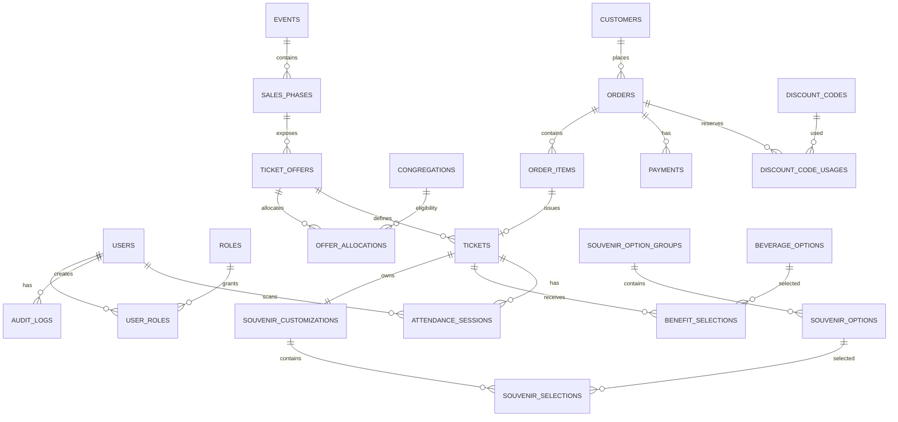

# 14 — Final ERD and Persistence Model

## 1. Modeling Goals

The database must support:

- three configurable sales phases
- multiple ticket offers per phase
- quota allocation that is configurable
- Early Bird eligibility by congregation
- Hosiana Early Bird discount usage limit
- dynamic beverage catalog
- Presale benefit entitlements
- per-ticket souvenir customization
- multiple tickets per order
- manual payment review
- order expiration/cancellation
- reusable entry/exit attendance sessions
- immutable transaction snapshots
- audit logging

## 2. Logical ERD



## 3. Important Entities

### events

One event record for HOSIFEST.

### sales_phases

Examples:
- EARLY_BIRD
- PRESALE
- NORMAL

Fields:
- id
- event_id
- code
- name
- start_at
- end_at
- visibility
- status
- display_order

### ticket_offers

A purchasable ticket configuration.

Fields:
- id
- sales_phase_id
- code
- name
- base_price
- quota
- purchase_limit_min
- purchase_limit_max
- visibility
- sales_channel
- status

Initial seeded offers:

```text
EARLY_BIRD
PRESALE
NORMAL
```

The system may use multiple allocation rules under an offer.

### offer_allocations

Provides configurable quota and eligibility within a ticket offer.

Example:

```text
EARLY_BIRD
├── Hosiana allocation
│   ├── quota 35
│   └── requires Hosiana discount code
└── Mupel JakPus allocation
    ├── quota 60
    └── requires configured Mupel congregation
```

This avoids hardcoding the allocation inside business logic.

### congregations

Initial values are the 12 GPIB Mupel Jakarta Pusat congregations defined in the business rules.

### orders

Commercial transaction and expiration state.

### order_items

Each line item captures quantity and immutable unit-price snapshot.

### tickets

Exactly one ticket per ticket order item unit after payment approval.

### souvenir_customizations

Exactly one record per issued ticket.

### souvenir_selections

Selections reference the current option catalog but additionally store an immutable snapshot.

### beverage_options

Dynamic catalog for Presale benefit selection.

### benefit_selections

Stores the actual beverage/tumbler entitlement selected/allocated for a ticket.

### discount_codes

A promotion/eligibility code with configurable usage limits.

### discount_code_usages

Transactional usage/reservation ledger.

### attendance_sessions

Entry/exit sessions. Re-entry creates a new session after an exit.

## 4. Historical Snapshot Principle

The following must be snapshotted:

- ticket offer name
- unit price
- discount amount
- applied discount code
- congregation display name
- beverage display name
- souvenir option group and option names/codes
- benefit description

Changing the catalog must never rewrite historical transaction meaning.

## 5. Concurrency Boundaries

The following operations must be transactional:

- ticket quota reservation
- discount usage reservation
- order expiration
- payment rejection/cancellation
- payment approval and ticket issuance

