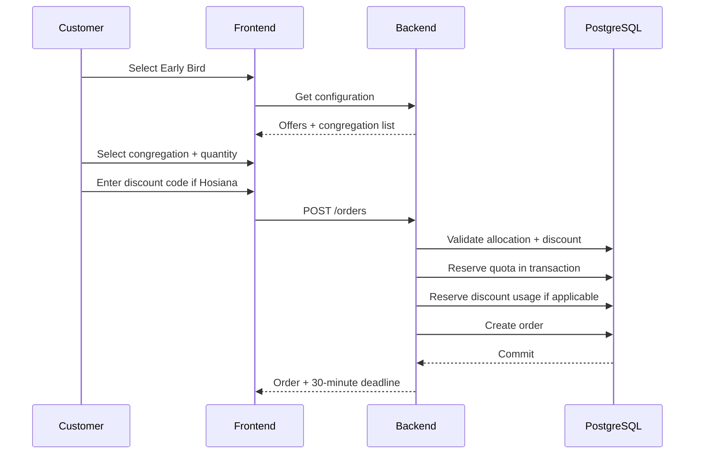
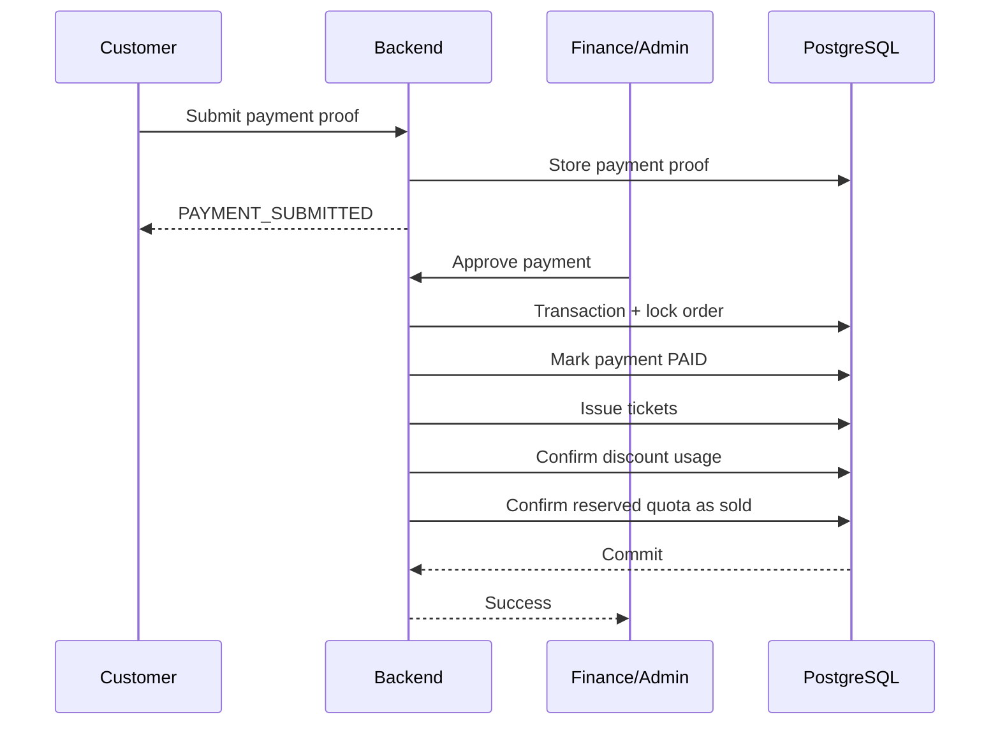
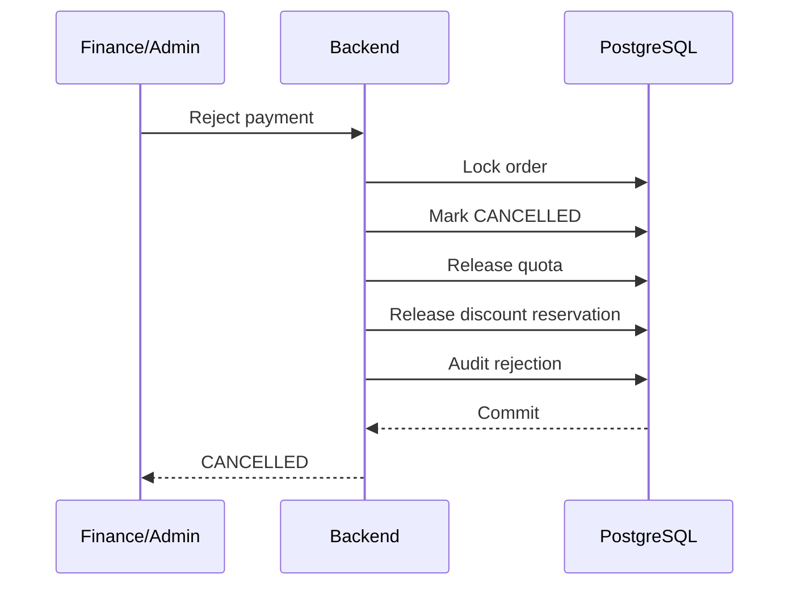
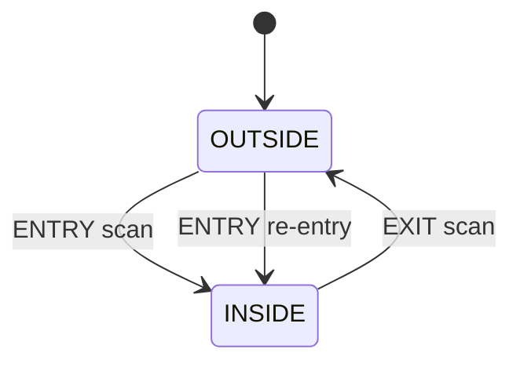

# 17 — Sequence Diagrams and State Machines

## 1. Early Bird Purchase



## 2. Presale Purchase

```text
Presale Rp225.000
    ↓
Ticket quantity
    ↓
For each ticket:
  ├── choose beverage
  └── customize souvenir
    ↓
Server validation
    ↓
Create order
```

## 3. Payment Approval



## 4. Payment Rejection



## 5. Expiration

```text
Scheduler/Worker
      ↓
find WAITING_PAYMENT orders with expires_at <= now
      ↓
transaction
  ├── lock order
  ├── verify still unpaid
  ├── EXPIRED
  ├── release quota
  └── release discount reservation
      ↓
commit
```

## 6. Attendance



No active session:

```text
ENTRY → create attendance session
```

Active session:

```text
ENTRY → ALREADY_INSIDE
```

No active session on exit:

```text
EXIT → ALREADY_OUTSIDE
```

## 7. Order State

```text
WAITING_PAYMENT
   ├── payment proof → PAYMENT_SUBMITTED
   ├── 30 minutes → EXPIRED
   └── administrative cancellation if explicitly permitted

PAYMENT_SUBMITTED
   ├── approve → PAID
   └── reject → CANCELLED

EXPIRED → terminal
CANCELLED → terminal
PAID → ticket issuance
```

## 8. Ticket State

```text
PENDING_ISSUANCE
      ↓
ISSUED
      ↓
VALID
```

Any void/correction is an explicit administrative operation.

## 9. Souvenir State

```text
DRAFT
  ↓ payment approved
CONFIRMED
  ↓
IN_PRODUCTION
  ↓
READY
  ↓
HANDED_OVER
```
